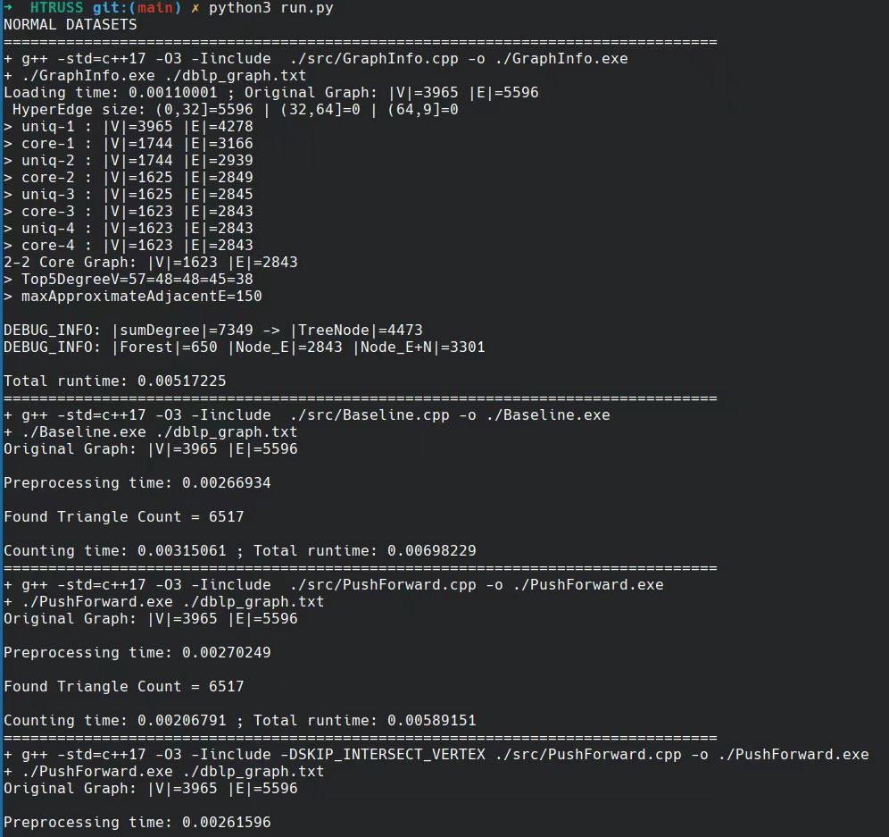
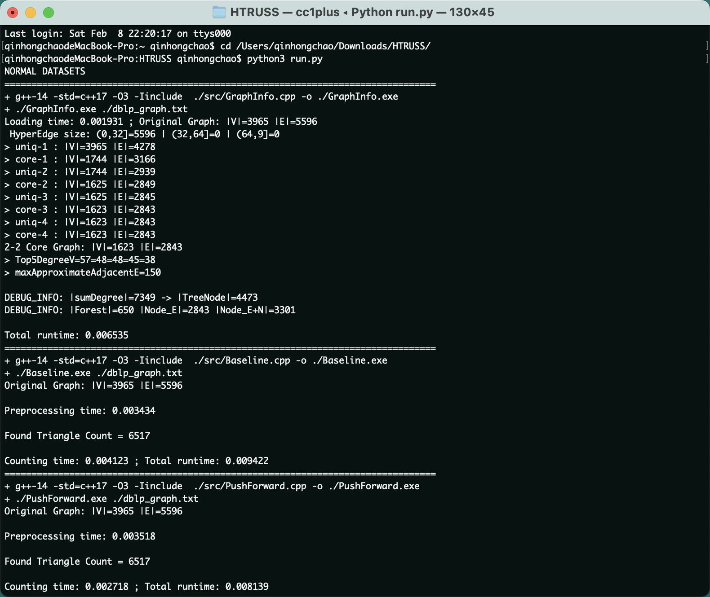
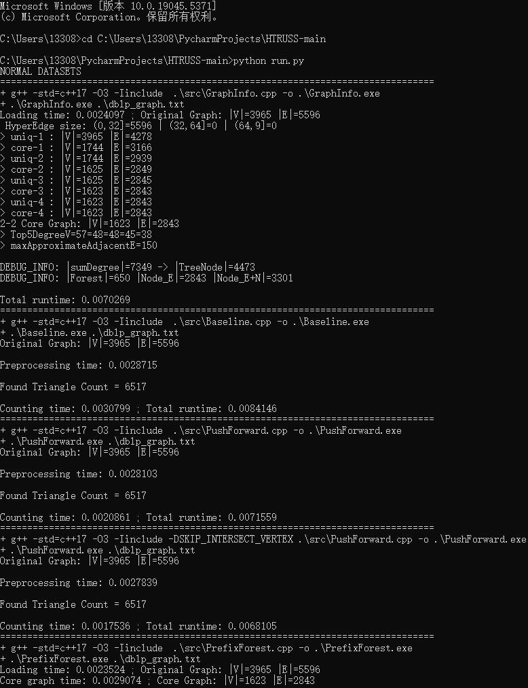

# Code for HTRUSS Algorithm
 This repository contains a reference implementation of the algorithms for the paper:
 Truss Decomposition in Hypergraphs.

 ## Dateset description
 For example, in "dblp_graph.txt", each line presents a hyperedge.
| line id | content  | 
| :----:  |:----: |
|0| 0,1,2,3|
|1| 6,7|
|...|...|

means that hyperedge E<sub>0</sub> contains 4 nodes u<sub>0</sub>,u<sub>1</sub>,u<sub>2</sub>,u<sub>3</sub>, and hyperedge E<sub>1</sub> contains 2 nodes u<sub>6</sub>,u<sub>7</sub>.


 ## Running Instructions

To run this program, you are required to have gcc and Python 3 installed. We have successfully executed it on Linux, Windows, and macOS platforms.

Here is the command to run it: 

```python3 run.py```

Results:

 ```NORMAL DATASETS
================================================================================
+ g++ -std=c++17 -O3 -Iinclude  ./src/GraphInfo.cpp -o ./GraphInfo.exe
+ ./GraphInfo.exe ./dblp_graph.txt
Loading time: 0.00110801 ; Original Graph: |V|=3965 |E|=5596
 HyperEdge size: (0,32]=5596 | (32,64]=0 | (64,9]=0
> uniq-1 : |V|=3965 |E|=4278
> core-1 : |V|=1744 |E|=3166
> uniq-2 : |V|=1744 |E|=2939
> core-2 : |V|=1625 |E|=2849
> uniq-3 : |V|=1625 |E|=2845
> core-3 : |V|=1623 |E|=2843
> uniq-4 : |V|=1623 |E|=2843
> core-4 : |V|=1623 |E|=2843
2-2 Core Graph: |V|=1623 |E|=2843
> Top5DegreeV=57=48=48=45=38
> maxApproximateAdjacentE=150

DEBUG_INFO: |sumDegree|=7349 -> |TreeNode|=4473
DEBUG_INFO: |Forest|=650 |Node_E|=2843 |Node_E+N|=3301

Total runtime: 0.00507834
================================================================================
+ g++ -std=c++17 -O3 -Iinclude  ./src/Baseline.cpp -o ./Baseline.exe
+ ./Baseline.exe ./dblp_graph.txt
Original Graph: |V|=3965 |E|=5596

Preprocessing time: 0.00249124

Found Triangle Count = 6517

Counting time: 0.00305172 ; Total runtime: 0.00676689
================================================================================
+ g++ -std=c++17 -O3 -Iinclude  ./src/PushForward.cpp -o ./PushForward.exe
+ ./PushForward.exe ./dblp_graph.txt
Original Graph: |V|=3965 |E|=5596

Preprocessing time: 0.00260551

Found Triangle Count = 6517

Counting time: 0.00206239 ; Total runtime: 0.0058418
================================================================================
+ g++ -std=c++17 -O3 -Iinclude -DSKIP_INTERSECT_VERTEX ./src/PushForward.cpp -o ./PushForward.exe
+ ./PushForward.exe ./dblp_graph.txt
Original Graph: |V|=3965 |E|=5596

Preprocessing time: 0.00260291

Found Triangle Count = 6517

Counting time: 0.0015972 ; Total runtime: 0.00532011
================================================================================
+ g++ -std=c++17 -O3 -Iinclude  ./src/PrefixForest.cpp -o ./PrefixForest.exe
+ ./PrefixForest.exe ./dblp_graph.txt
Loading time: 0.00114025 ; Original Graph: |V|=3965 |E|=5596
Core graph time: 0.00280417 ; Core Graph: |V|=1623 |E|=2843
Sort graph time: 9.0198e-05
Build tree time: 0.000927512

Preprocessing time: 0.00383466

Found Triangle Count = 6517

Counting time: 0.00164792 ; Total runtime: 0.00664091
================================================================================
+ g++ -std=c++17 -O3 -Iinclude -DPROGRESSIVE_COUNTING ./src/PrefixForest.cpp -o ./PrefixForest.exe
+ ./PrefixForest.exe ./dblp_graph.txt
Loading time: 0.00113207 ; Original Graph: |V|=3965 |E|=5596
Core graph time: 0.00244522 ; Core Graph: |V|=1623 |E|=2843
Sort graph time: 8.5901e-05
Build tree time: 0.000902525

Preprocessing time: 0.00344354

Found Triangle Count = 6517

Counting time: 0.00111688 ; Total runtime: 0.00571082
================================================================================
+ g++ -std=c++17 -O3 -Iinclude -DPROGRESSIVE_COUNTING -DUSING_BITMAP ./src/PrefixForest.cpp -o ./PrefixForest.exe
+ ./PrefixForest.exe ./dblp_graph.txt
Loading time: 0.00110325 ; Original Graph: |V|=3965 |E|=5596
Core graph time: 0.00262943 ; Core Graph: |V|=1623 |E|=2843
Sort graph time: 8.6289e-05
Build tree time: 0.000982177

Preprocessing time: 0.00372069

Found Triangle Count = 6517

Counting time: 0.000874304 ; Total runtime: 0.00571441
================================================================================
+ g++ -std=c++17 -O3 -Iinclude  ./src/Baseline.cpp -o ./Baseline.exe
+ ./Baseline.exe ./dblp_graph.txt
Original Graph: |V|=3965 |E|=5596

Preprocessing time: 0.00274703

Found Triangle Count = 6517

Counting time: 0.00305132 ; Total runtime: 0.00689519
+ ./Baseline.exe ./dblp_graph.txt
Original Graph: |V|=3965 |E|=5596

Preprocessing time: 0.00269738

Found Triangle Count = 6517

Counting time: 0.0030551 ; Total runtime: 0.00686218
================================================================================
+ g++ -std=c++17 -O3 -Iinclude  ./src/PushForward.cpp -o ./PushForward.exe
+ ./PushForward.exe ./dblp_graph.txt
Original Graph: |V|=3965 |E|=5596

Preprocessing time: 0.00268455

Found Triangle Count = 6517

Counting time: 0.0020726 ; Total runtime: 0.00593299
+ ./PushForward.exe ./dblp_graph.txt
Original Graph: |V|=3965 |E|=5596

Preprocessing time: 0.00265459

Found Triangle Count = 6517

Counting time: 0.00209399 ; Total runtime: 0.00584508
================================================================================
+ g++ -std=c++17 -O3 -Iinclude -DSKIP_INTERSECT_VERTEX ./src/PushForward.cpp -o ./PushForward.exe
+ ./PushForward.exe ./dblp_graph.txt
Original Graph: |V|=3965 |E|=5596

Preprocessing time: 0.00269757

Found Triangle Count = 6517

Counting time: 0.00155589 ; Total runtime: 0.00537333
+ ./PushForward.exe ./dblp_graph.txt
Original Graph: |V|=3965 |E|=5596

Preprocessing time: 0.00248462

Found Triangle Count = 6517

Counting time: 0.00160305 ; Total runtime: 0.0052301
================================================================================
+ g++ -std=c++17 -O3 -Iinclude  ./src/PrefixForest.cpp -o ./PrefixForest.exe
+ ./PrefixForest.exe ./dblp_graph.txt
Loading time: 0.00110838 ; Original Graph: |V|=3965 |E|=5596
Core graph time: 0.00263138 ; Core Graph: |V|=1623 |E|=2843
Sort graph time: 0.000105628
Build tree time: 0.000920589

Preprocessing time: 0.00366687

Found Triangle Count = 6517

Counting time: 0.00159958 ; Total runtime: 0.00639152
+ ./PrefixForest.exe ./dblp_graph.txt
Loading time: 0.00106399 ; Original Graph: |V|=3965 |E|=5596
Core graph time: 0.00265906 ; Core Graph: |V|=1623 |E|=2843
Sort graph time: 0.000105731
Build tree time: 0.000889185

Preprocessing time: 0.00366343

Found Triangle Count = 6517

Counting time: 0.00154553 ; Total runtime: 0.00628701
================================================================================
+ g++ -std=c++17 -O3 -Iinclude -DPROGRESSIVE_COUNTING ./src/PrefixForest.cpp -o ./PrefixForest.exe
+ ./PrefixForest.exe ./dblp_graph.txt
Loading time: 0.00110417 ; Original Graph: |V|=3965 |E|=5596
Core graph time: 0.00264786 ; Core Graph: |V|=1623 |E|=2843
Sort graph time: 0.000106626
Build tree time: 0.000932524

Preprocessing time: 0.00369594

Found Triangle Count = 6517

Counting time: 0.00113054 ; Total runtime: 0.00594743
+ ./PrefixForest.exe ./dblp_graph.txt
Loading time: 0.00116509 ; Original Graph: |V|=3965 |E|=5596
Core graph time: 0.00260279 ; Core Graph: |V|=1623 |E|=2843
Sort graph time: 0.000105379
Build tree time: 0.000893104

Preprocessing time: 0.00361053

Found Triangle Count = 6517

Counting time: 0.00112616 ; Total runtime: 0.00591565
================================================================================
+ g++ -std=c++17 -O3 -Iinclude -DPROGRESSIVE_COUNTING -DUSING_BITMAP ./src/PrefixForest.cpp -o ./PrefixForest.exe
+ ./PrefixForest.exe ./dblp_graph.txt
Loading time: 0.00108504 ; Original Graph: |V|=3965 |E|=5596
Core graph time: 0.00262766 ; Core Graph: |V|=1623 |E|=2843
Sort graph time: 0.000104629
Build tree time: 0.000915646

Preprocessing time: 0.00365734

Found Triangle Count = 6517

Counting time: 0.000869067 ; Total runtime: 0.00562753
+ ./PrefixForest.exe ./dblp_graph.txt
Loading time: 0.00114166 ; Original Graph: |V|=3965 |E|=5596
Core graph time: 0.00262926 ; Core Graph: |V|=1623 |E|=2843
Sort graph time: 0.000105884
Build tree time: 0.000983158

Preprocessing time: 0.00372809

Found Triangle Count = 6517

Counting time: 0.000894174 ; Total runtime: 0.00577909
 ```

### Run on Linux


### Run on macOS
First, execute the command ```brew install gcc``` to switch from Clang to GCC as your compiler. Ensure that the version of GCC you install is 14.




### Run on Windows
Ensure that ```Mingw64``` is properly installed and the CMD environment variables are properly configured.




 


